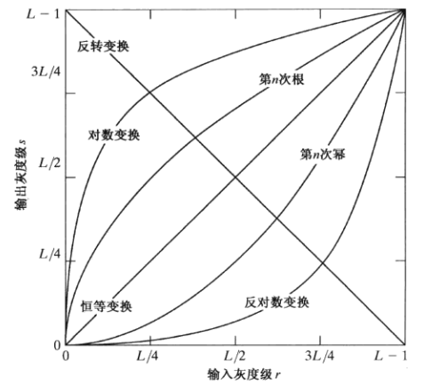
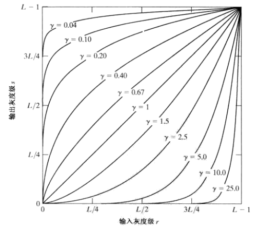

# 快速开始
### 搭建环境
##### 推荐使用miniconda创建虚拟环境（下载地址https://repo.anaconda.com/miniconda/Miniconda3-latest-Windows-x86_64.exe）
```
conda create -n DIP python=3.8
conda activate DIP
pip install -r requirements.txt -i https://pypi.tuna.tsinghua.edu.cn/simple # 用清华源镜像加速
```
##### 直接安装
```
pip install -r requirements.txt -i https://pypi.tuna.tsinghua.edu.cn/simple # 用清华源镜像加速
```
### 运行
```
cd ./Experiment_GUET/src
python Grayscale_transformation.py
```
### 结果图在./Experiment_GUET/image目录下

# 知识点
## 灰度变换
灰度图像是一种每个像素仅包含一个亮度值的图像类型，用于表示从最暗的黑色到最亮的白色之间的不同明暗层次。与只有黑白两种颜色的二值图像不同，灰度图像在黑与白之间有多个灰度级，能够更细腻地表现图像细节。

灰度值通常用 0–255 表示，其中 0 表示纯黑，255 表示纯白，中间值表示不同亮度的灰色。灰度值越大，像素越亮；越小则越暗。

存储与精度 常见的灰度图像使用 8 位非线性尺度存储，每个像素有 256 种可能的灰度级


### 1. 图像反转

获取像素值在`[0, L]`范围内的图像的反转图像. 适用于增强图像中白色或者灰色的区域, 尤其当黑色在图片中占主地位时候.

```
T(r) = L - r
```

### 2. 对数变换



由于对数曲线在像素值较低的区域斜率大, 在像素值较高的区域斜率较小, 所以图像经过对数变换后, 较暗区域的对比度将有所提升. 可用于增强图像的暗部细节.

```
s = c * log(1 + r)
```

### 3. 幂律(伽马)变换



伽马变换可以很好地拉伸图像的对比度, 扩展灰度级. 由图可知, 当图像的整体灰度偏暗时, 选择gamma<1, 可以使图像增亮; 当图像整体灰度偏亮时, 选择gamma>1, 可以使图像变暗, 提高图像的对比度, 凸显细节.

用于图像获取、打印和显示的各种设备根据幂律来产生响应, 用于校正这些幂律响应现象的处理称为**伽马校正**. 
例如, 阴极射线管(CRT)设备有一个灰度-电压响应, 该响应是一个指数变化范围约为1.8~2.5的幂函数.

```
s = c * r ^ (gamma)
```

### 3. 分段线性变换


## 直方图均衡化（`Histogram_process.py`）

1. 计算每个灰度级的 PDF（Probability Density Function，归一化直方图即离散 PDF）。
2. 计算 CDF（Cumulative Distribution Function，累计分布函数）。
3. 映射关系（离散、256 级时）：

```text
s_k = round((L - 1) * cdf[k])   （L = 256 时输出落在 0～255）
```

有了映射表，即可把每个像素的原灰度换成新灰度，得到均衡后的图像。

---

## 空间滤波器（`Spatial_filter.py`）

空间滤波是在**图像平面本身**上对像素及其**邻域**做运算，不变换到其他域（区别于频域滤波）。邻域与一组**系数**（核、掩模、模板）做卷积或统计运算，得到新像素值。掩模里的数是**权重/系数**，不是图像灰度。

### 滤波具体是怎么工作的

可以把空域滤波理解成：**用一个固定形状的窗口（如 3×3）在整幅图上逐格滑动**，对**每一个像素位置**都算出一个新值，写入结果图里对应位置；原图一般**不被改写**，输出与输入**同尺寸**（彩色图则按通道或算子定义处理）。

按运算类型大致分两类：

1. **线性滤波（卷积型，如均值、高斯、Sobel/Prewitt 模板）**  
   在窗口内把**每个像素乘以核上对应系数再求和**（再除以归一化因子、取绝对值等）。本质是**邻域加权和**。核越大，参与运算的像素越多：平滑类核会让图像更糊；梯度类核则覆盖更大的差分范围。

2. **非线性滤波（如中值、最大、最小）**  
   不做固定系数的加权和，而是对邻域灰度做**排序或取极值**（中位数、最大值、最小值），因此一般**不能**写成“一个卷积核乘加”。

无论哪种，当前正在处理的那个坐标都是窗口的**中心**；窗口关于该中心对称放置（例如 3×3 以该像素为中心）。

### “边缘”分两种：图像边界 vs 灰度边缘

中文里说“边缘”容易混指两件事，滤波时的处理也完全不同。

**1）图像四周边界上的像素（最外几行、几列）**

算邻域时，窗口会向四周伸出；在**最靠外**的像素处，邻域会**超出图像范围**，外面没有真实灰度可用。实现上必须先做**边界填充（padding）**：在四周假想出一圈“虚拟像素”，再对原图有效区域内的每个点照常取邻域运算。

- 本项目中 **`mean_blur`、`box_blur`、`gaussian_blur`、`median_blur`**，以及 **`laplacian`、`sobel_gradient`、`prewitt_gradient`、`roberts_gradient`、`canny`** 等，均调用 OpenCV，边界行为遵循其**默认边界类型**（通常为 `BORDER_DEFAULT`，效果上接近**反射/镜像**，避免在边界处整块变成同一常数带来的生硬截断）。  
- **`max_filter` / `min_filter`** 在 `Spatial_filter.py` 里用手写循环实现，显式使用 **`copyMakeBorder(..., BORDER_CONSTANT, value=0)`**，即虚拟像素为 **0（黑）**。因此**图像最外圈附近**的邻域里会掺入“假黑”，与上面 OpenCV 内置滤波在边界上的结果**可能不一致**，对比实验时需要注意。

常见填充策略还有：**常数 0**、**复制边缘一行/列**、**对称/周期延拓** 等。不同策略只影响靠近边界、厚度约 **核半径** 的那一圈；**图像内部**、邻域完全落在图内的像素，结果与填充方式无关。

**2）图像内容里的灰度边缘（轮廓、明暗交界）**

这里不是“缺像素”，而是**灰度跳变**：

- **平滑滤波**：窗口同时盖住跳变两侧，输出往往是两侧灰度的平均或某种统计量，因此**真实的物体边缘会变钝、变宽**，细节被抹平——这是平滑的固有代价。  
- **锐化 / 梯度 / 拉普拉斯**：正是利用这种跳变，在边缘处产生**强响应**，从而**突出轮廓**；同时也会让噪声处的跳变变明显。

### 平滑滤波

- **目的**：抑制噪声、模糊细节；随机噪声常表现为灰度突变，平滑会削弱这种突变。
- **副作用**：真实边缘也是突变，会被一起模糊。

#### 线性平滑（均值 / 盒式 / 高斯）

- **均值滤波**：邻域内算术平均，模板越大越模糊、细节丢失越多。
- **盒式滤波**：与归一化均值类似；可不归一化做邻域求和实验。
- **高斯滤波**：中心权重大、边缘权重小，模糊更平滑，常作 Canny 等算法的预处理。

对应类方法：`mean_blur`、`box_blur`、`gaussian_blur`。

#### 非线性平滑（统计排序）

- **中值滤波**：邻域排序取中位数，对**椒盐噪声**效果好，比同尺寸均值更能保留阶跃边缘。
- **最大值 / 最小值滤波**：邻域取 max/min；本实现中彩色图会先转灰度（与 `3.4` 目录下 `maxminblur.py` 思路一致），便于教学用双重循环看清过程。

对应类方法：`median_blur`、`max_filter`、`min_filter`。

### 锐化滤波

- **目的**：增强边缘和细节，或补偿之前的模糊。
- **原理**：与灰度**变化率**有关；一阶导数（梯度）在边缘处幅度大，二阶导数（拉普拉斯）在边缘过零或呈强响应。

#### 拉普拉斯（二阶）

- 对图像做拉普拉斯近似，突出突变区域，也会放大噪声。
- **锐化叠加**：\(g = f + c \cdot \nabla^2 f\) 的离散形式，即原图加上（加权后的）拉普拉斯响应。

对应类方法：`laplacian`、`laplacian_sharpen`。

#### 梯度（一阶）：Sobel、Prewitt、Roberts

- **Sobel**：带平滑的 3×3 一阶差分，x/y 方向分别卷积再合成幅值；实现中用 `CV_16S` 避免 `uint8` 截断，再 `convertScaleAbs`。
- **Prewitt**：3×3 模板，性质与 Sobel 类似，教材中常对比讨论。
- **Roberts**：2×2 交叉模板，实现简单，对对角方向边缘较敏感。

对应类方法：`sobel_gradient`、`prewitt_gradient`、`roberts_gradient`。

### Canny 边缘检测

- 一般只处理**灰度图**；类中会自动将 BGR 转灰度。
- 典型流程：高斯平滑 → 梯度幅值与方向 → 非极大抑制 → **双阈值**滞后跟踪，得到细、连通的边缘。
- 参数 `threshold1`、`threshold2` 控制强弱边缘的取舍。

对应类方法：`canny`。

### 如何使用 `SpatialFilterProcessor`

```python
import cv2
from Spatial_filter import SpatialFilterProcessor

img = cv2.imread("xxx.png")  # BGR
sp = SpatialFilterProcessor()

blur = sp.mean_blur(img, (5, 5))
edges = sp.sobel_gradient(img, ksize=3)
sharp = sp.laplacian_sharpen(img, ksize=3, weight=1.0)
edge_map = sp.canny(img, 50, 150)

# 或字符串统一入口
out = sp.apply(img, "median", ksize=5)
```

